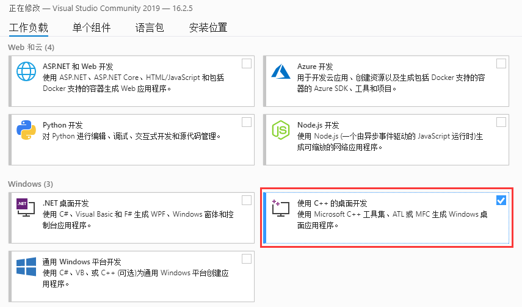
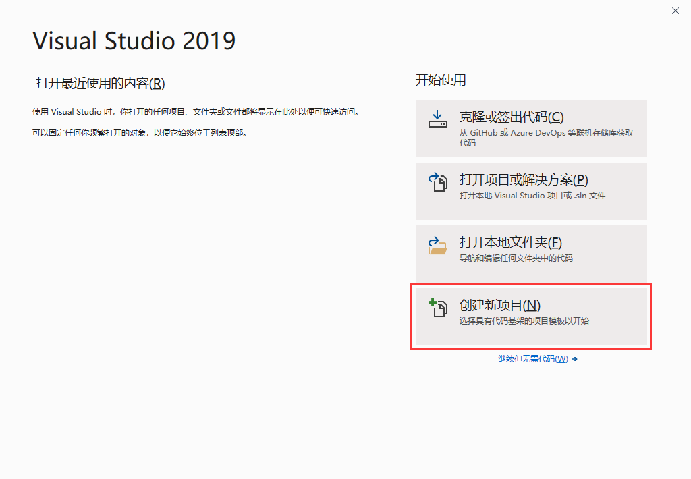
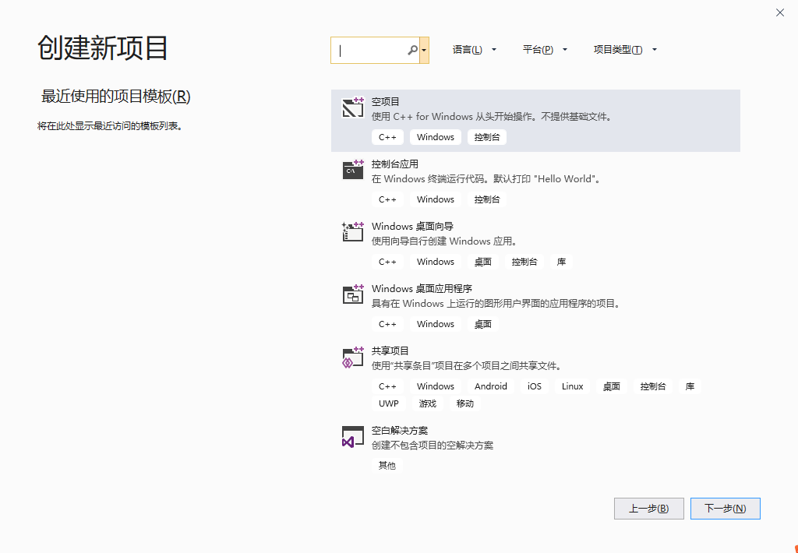
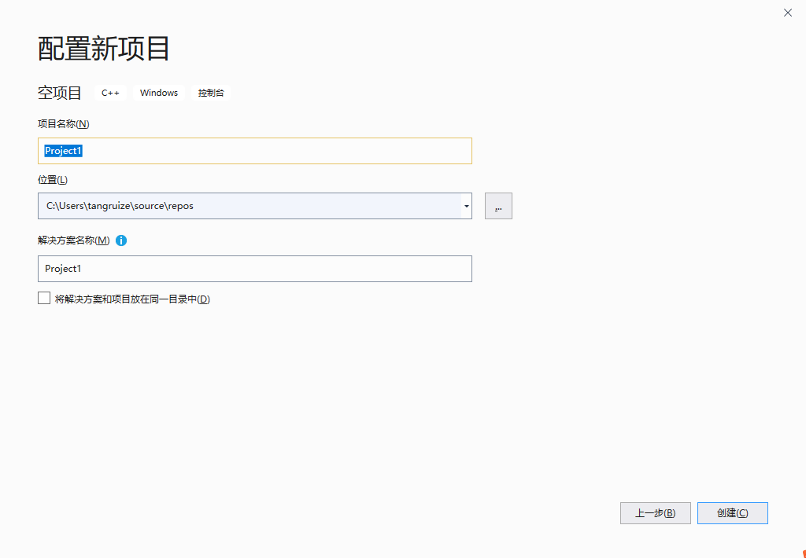
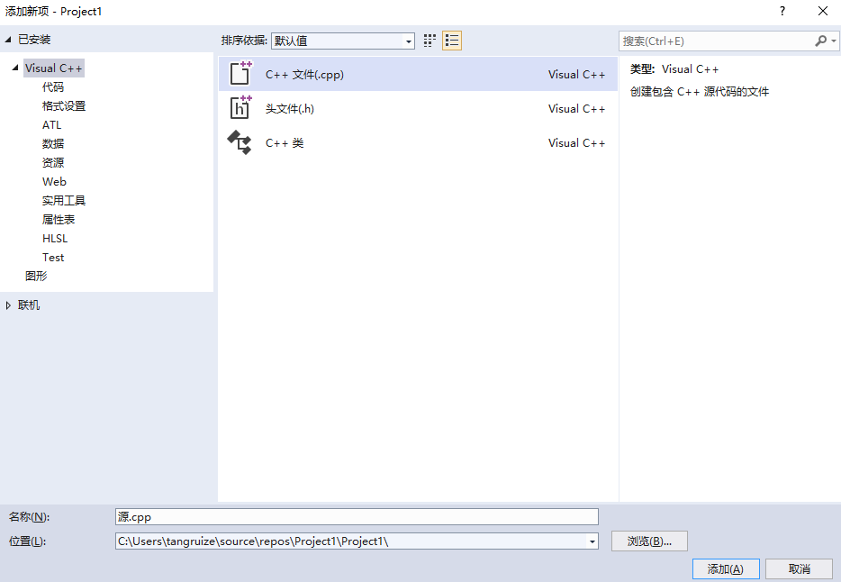
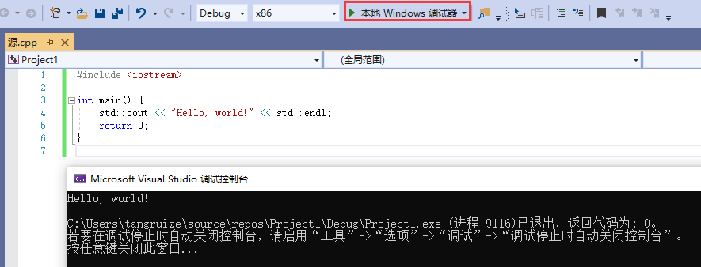
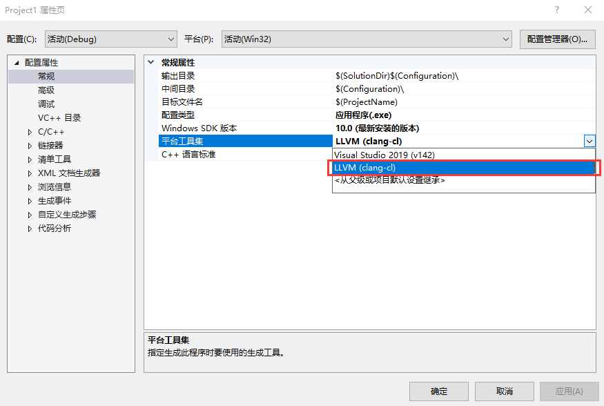

# [Microsoft Visual Studio](https://visualstudio.microsoft.com/)
*如果你不是Windows用户，那么本章就不用看了。*

这是微软自家的集成开发环境，可以用来开发微软支持的所有平台的程序，因此这个IDE（以下可能简称VS）非常庞大，我们仅使用C++需要的功能。

## 安装

1. 下载[Visual Studio Community](https://visualstudio.microsoft.com/zh-hans/free-developer-offers/)并打开

2. 如图勾选C++需要的功能（只需要勾选 "使用C++的桌面开发" ）：<br>
 
 
3. 推荐勾选 C++ Clang<br><br>
 
 
4. 等待安装结束。

## 编写第一个程序

1. 打开 Visual Studio 2019

2. 创建一个新的项目<br>
 

3. 选择空项目<br>
 

4. 为项目起个名字<br>
 

5. 在 ”解决方案资源管理器" 中右键源代码，添加新建项<br>
 

6. 选择 "C++文件" 并命名<br>
 

7. 编写下面的代码并点击 "本地Windows调试器" 运行

    ```cpp
    #include <iostream>  
      
    int main() {  
        std::cout << "Hello, World!" << std::endl;  
        return 0;  
    }
    ``` 
    
 

8. 默认MSVC编译器有很多不符合标准的规则，不利于C/C++学习或通过OJ系统，可以使用Clang编译器。项目-属性-常规-平台工具集-LLVM<br>
 

## 结语
现在你已经掌握了VS基本使用方法，更多的功能请自行探索吧！
